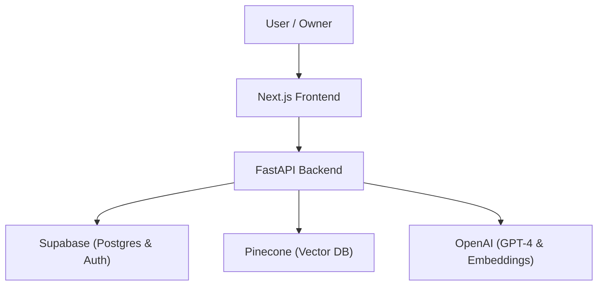

# Verified Digital Twin Brain

A multi-tenant, Retrieval-Augmented Generation (RAG) platform designed to provide grounded, citation-backed answers from a verified knowledge base.

## 🏗️ Architecture



## 🚀 Features

- **Multi-Tenant Identity**: Tenant and Digital Twin resolution with built-in role enforcement (Owner vs. Viewer).
- **Verified Ingestion**: Automated PDF text extraction, chunking, and vectorization into Pinecone.
- **Grounded Answering**: Constrained prompt engineering that mandates source citations and prevents hallucinations.
- **Trust Layer**: Automated confidence scoring and escalation workflow for human-in-the-loop verification.
- **Owner Dashboard**: Comprehensive console for monitoring twin performance and managing knowledge sources.

## 🛠️ Tech Stack

- **Frontend**: Next.js 14, Tailwind CSS, TypeScript, Supabase Auth.
- **Backend**: FastAPI (Python), Pinecone, OpenAI, LangChain.
- **Database**: PostgreSQL (Supabase).

## 📥 Getting Started

### Prerequisites

- Python 3.10+
- Node.js 18+
- Accounts: Supabase, Pinecone, OpenAI.

### 1. Backend Setup

```bash
cd backend
pip install -r requirements.txt
cp .env.example .env
# Fill in your .env keys
python main.py
```

### 2. Frontend Setup

```bash
cd frontend
npm install
cp .env.local.example .env.local
# Fill in your .env.local keys
npm run dev
```

### 3. Database Setup

Run the `supabase_schema.sql` file in your Supabase SQL Editor to initialize the required tables.

## 📂 Project Structure

- `backend/`: FastAPI application and logic modules.
- `frontend/`: Next.js application and components.
- `supabase_schema.sql`: Database schema definition.

## 📜 License

MIT
