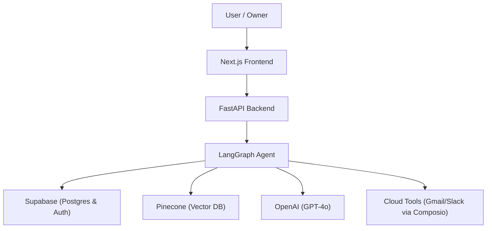

# Verified Digital Twin Brain

A multi-tenant, Retrieval-Augmented Generation (RAG) platform designed to provide grounded, citation-backed answers from a verified knowledge base, now evolving into a stateful, agentic brain.

## Architecture

The system uses a stateful reasoning loop (powered by LangGraph) to decide when to retrieve knowledge, use tools, or generate a response.



## Features

- **Agentic Reasoning**: Uses LangGraph for multi-step "Chain of Thought" reasoning.
- **Verified Memory**: Automatic high-priority vector injection for owner-verified answers.
- **Multi-Tenant Identity**: Tenant and Digital Twin resolution with built-in role enforcement.
- **Verified Ingestion**: Automated PDF extraction and vectorization into Pinecone.
- **Trust Layer**: Automated confidence scoring and escalation workflow for human review.
- **Cloud Ready**: Pre-configured for deployment on Railway, Render, and Vercel.

## Tech Stack

- **Frontend**: Next.js 14, Tailwind CSS, TypeScript, Supabase Auth.
- **Backend**: FastAPI (Python), LangGraph, LangChain, Pinecone, OpenAI.
- **Automation**: Composio (Cloud Tool Integration).
- **Database**: PostgreSQL (Supabase).

## Getting Started

### Prerequisites

- Python 3.10+
- Node.js 18+
- Accounts: Supabase, Pinecone, OpenAI, Composio.

### 1. Backend Setup

```bash
cd backend
python -m venv .venv
# Activate venv
pip install -r requirements.txt
cp .env.example .env
# Fill in your .env keys
python main.py
```

### 2. Frontend Setup

```bash
cd frontend
npm install
cp .env.local.example .env.local
# Fill in your .env.local keys
npm run dev
```

### 3. Database Setup

Run the `supabase_schema.sql` file in your Supabase SQL Editor to initialize the required tables.

## Project Structure

- `backend/`: FastAPI application and LangGraph logic.
- `frontend/`: Next.js application and dashboard components.
- `supabase_schema.sql`: Database schema definition.

## License

MIT
